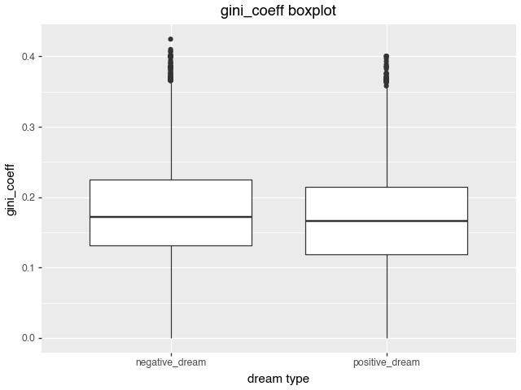
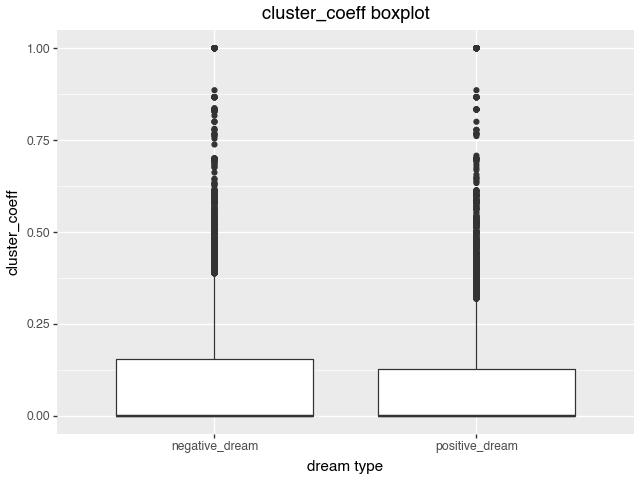
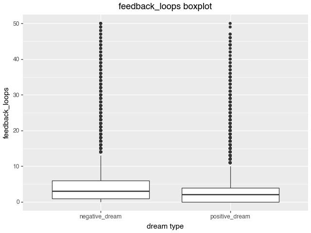

# Subtopic 3: the shape of nightmares

This folder contains the analysis materials for subtopic 3 of the final project. The topic studies whether negative dreams show more cyclic graph structures than positive dreams after dream narratives are converted into entity-transition networks.

## Research question

The subtopic asks whether nightmares are more likely to "loop" around the same entities or scenes. The working hypothesis is:

- Positive dreams tend to have a more linear narrative structure.
- Negative dreams tend to contain more repeated transitions, local cycles, and dominant entities.

The analysis represents each dream as a directed graph. Nodes are extracted entities, and directed edges are built from adjacent entities in the time-ordered `entity_sequence`.

## Main workflow

1. Use LLM-processed dream records that contain sentiment labels and entity sequences.
2. Convert each `entity_sequence` into a directed graph.
3. Calculate graph metrics for each dream.
4. Compare metric distributions between positive and negative dreams.
5. Summarize the findings with tables, box plots, and presentation notes.

## Core metrics

| Metric | Meaning | Higher value suggests |
| --- | --- | --- |
| Clustering coefficient | Local tendency to form closed neighborhoods | More local loops in the dream graph |
| Average shortest path | Average shortest path length between connected nodes | More extended or linear transitions |
| Gini coefficient | Concentration of node degrees | A small number of entities dominate the dream |
| Feedback loops | Number of directed cyclic paths | More repeated or circular narrative structure |

The Gini coefficient formula is documented in [gini.md](gini.md).

## Results

The summary statistics are stored in [compare_table.csv](compare_table.csv). In the current comparison, negative dreams have higher mean values for the main cyclic-structure metrics:

| Metric | Negative dreams mean | Positive dreams mean | Interpretation |
| --- | ---: | ---: | --- |
| Clustering coefficient | 0.0990 | 0.0849 | Negative dreams show more local closure. |
| Feedback loops | 8.3817 | 4.4288 | Negative dreams contain more cyclic paths. |
| Gini coefficient | 0.1766 | 0.1642 | Negative dreams are slightly more dominated by central entities. |

These results support the subtopic hypothesis that negative dreams are more structurally repetitive than positive dreams.

## Visualizations

The `plots/` directory contains the cleaned plot assets used by the presentation notes.

The root-level image files are retained for compatibility with earlier notebook outputs and existing references.

## File guide

| File | Purpose |
| --- | --- |
| `subplot3.ipynb` | Main notebook for subtopic 3 network-metric processing. |
| `plot3.ipynb` | Notebook for result visualization and plot generation. |
| `compare_table.csv` | Summary statistics comparing positive and negative dreams. |
| `content.md` | Presentation draft for the subtopic narrative and slide content. |
| `gini.md` | Formula and interpretation notes for the Gini coefficient. |
| `plots/` | Cleaned plot assets referenced by this README and `content.md`. |
| `*_box_plot.jpg` | Existing plot outputs kept at the folder root for compatibility. |

## Notebook order

Run the notebooks in this order when reproducing the subtopic results:

1. `subplot3.ipynb` to build graph metrics from processed dream records.
2. `plot3.ipynb` to generate comparison plots and summary tables.

Both notebooks depend on the processed dream data generated by the earlier LLM-processing pipeline. They should be run from the project environment with the same data paths used by the final project notebooks.
